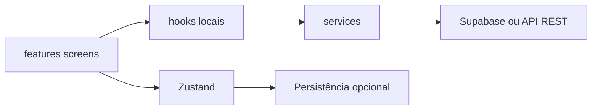

# Arquitetura — ConectaControle

## Visão geral

Aplicativo **Expo (SDK 54)** com **Expo Router**, **TypeScript** e UI **Gluestack UI** (`@gluestack-ui/themed` + `@gluestack-ui/config`).

**Backend (escolha um):**

- **PostgreSQL no seu servidor**: API Node em `server/` + JWT; o app usa `EXPO_PUBLIC_API_URL` (ver [self-hosted-postgres.md](./self-hosted-postgres.md)).
- **Supabase** (nuvem): PostgreSQL + Auth + RLS; `EXPO_PUBLIC_SUPABASE_*` quando não há `EXPO_PUBLIC_API_URL`.

Em ambos os casos o isolamento por `company_id` é obrigatório nas regras de negócio.

## Camadas

| Camada | Pasta | Responsabilidade |
|--------|--------|------------------|
| Rotas | `app/` | Apenas layouts, stacks e redirecionamentos; importa telas de `features/*/screens`. |
| Domínio | `features/<domínio>/` | Telas, componentes, hooks e tipos do domínio; adaptadores finos para serviços. |
| API / dados | `services/` | Cliente Supabase e/ou HTTP (`services/api/`) para API própria; sem JSX. |
| Estado global | `store/` | Zustand (sessão, carrinho PDV, override de marca). |
| UI compartilhada | `components/` | Primitivos (Screen, BigButton, EmptyState). |
| Design system | `ui/` | `GluestackUIProvider`, integração de tema; `ui/themes/*.theme.ts`. |
| Utilitários | `hooks/`, `utils/` | Helpers reutilizáveis. |

## Fluxo de dados

## Convenções

- **Multi-tenant**: toda leitura/escrita de negócio inclui `company_id` derivado do perfil do usuário autenticado.
- **Limite de arquivo**: nenhum arquivo acima de **300 linhas**; dividir telas e serviços.
- **Documentação**: regras canônicas em `docs/`; alterações de negócio exigem atualização dos `.md` correspondentes.

## Autenticação e isolamento

- **API própria**: JWT emitido pelo `server/` com `sub` (user id) e `cid` (company id). Cada query SQL filtra por `company_id` no backend.
- **Supabase**: JWT do Auth identifica `auth.uid()`; `profiles` liga ao `company_id`; RLS no PostgreSQL do Supabase.

## Evolução

- Relatórios avançados e notificações push podem ser adicionados sem alterar contratos de pastas.
- Integração WhatsApp: interface em `services/notifications` (ver `business-rules.md`).
