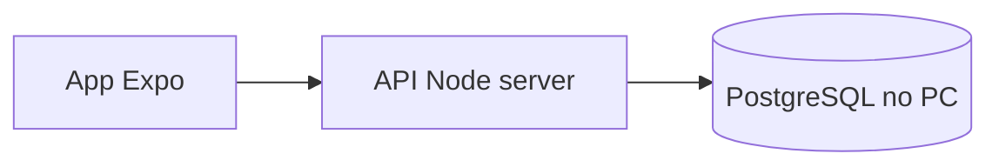

# PostgreSQL no seu servidor (rede local)

O app **não conecta direto** ao PostgreSQL. O fluxo é:



## 1. Instalar PostgreSQL no computador servidor

- Crie o banco, por exemplo: `CREATE DATABASE conectacontrole;`
- Aplique o schema: `server/sql/postgres_standalone.sql` (via `psql` ou cliente gráfico).

## 2. Configurar e subir a API

No diretório `server/`:

1. Copie `server/.env.example` para `server/.env`
2. Ajuste `DATABASE_URL` (usuário, senha, host, porta, nome do banco)
3. Defina `JWT_SECRET` (string longa e secreta)
4. Instale e rode:

```bash
cd server
npm install
npm run dev
```

Por padrão a API escuta em `0.0.0.0:4000` (acessível na rede local).

## 3. Configurar o app Expo

No `.env` na raiz do projeto React Native:

```
EXPO_PUBLIC_API_URL=http://IP_DO_SERVIDOR:4000/api
```

Use o **IP local** do PC (ex.: `192.168.1.50`), não `localhost`, para o celular na mesma Wi‑Fi.

### HTTP em desenvolvimento (Android)

Para `http://` sem certificado, pode ser necessário permitir tráfego claro no build nativo. Em desenvolvimento com Expo Go, teste na mesma rede; para build de produção use **HTTPS** (reverse proxy com nginx/Caddy) ou túnel seguro.

## 4. Firewall

Abra a porta **4000** (ou a que configurou em `PORT`) no firewall do Windows/Linux do servidor.

## 5. Segurança

- Não exponha PostgreSQL diretamente na internet; apenas a API.
- Em produção: HTTPS, senhas fortes no banco, `JWT_SECRET` único, backups do PostgreSQL.
